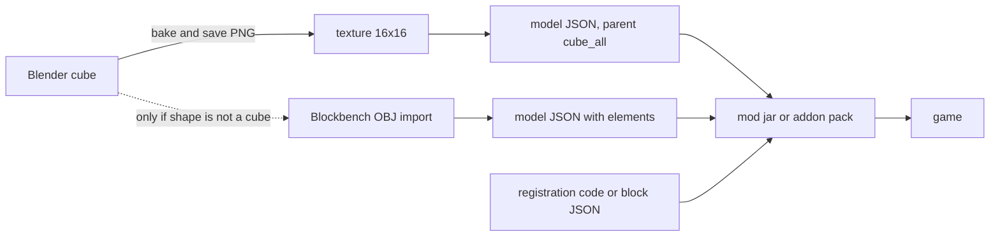
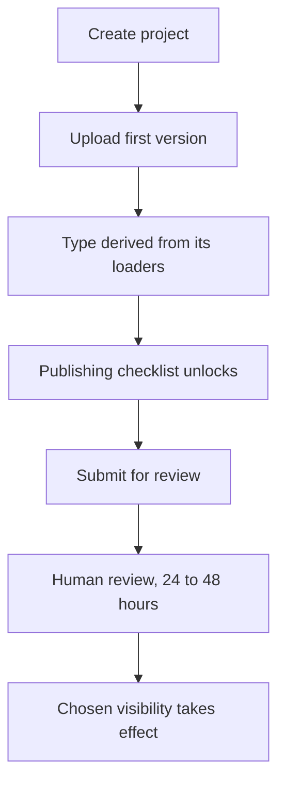

# Creating a Custom Block in Minecraft

How a brand new block type, rather than a variant of an existing one, gets made and shipped.

Java Edition needs a mod, written here against Fabric and Mojang official mappings. Bedrock Edition needs an addon, which is pure JSON. The two share nothing but the texture, so both halves are covered.

Target versions, and why they look unfamiliar, are in [README.md](README.md). Everything below is written for Minecraft 26.3 and Mojang official mappings. Section 7 lists what earlier versions did differently, because most tutorials online are still written against those.

## The core fact

Minecraft does not load Blender meshes. Block rendering uses its own JSON model format, in which geometry is an `elements` array of axis-aligned boxes. There are no triangles and no arbitrary meshes.

A plain cube needs no geometry at all, only a `parent` reference. So the useful output of a Blender cube is the **texture PNG**, not the model.



## 1. Saving the work out of Blender

### Cube case

1. UV unwrap the cube.
2. Bake the material to an image. Use a power-of-two size: 16x16, 32x32 or 64x64. Vanilla blocks are 16x16.
3. `Image > Save As` and choose PNG.
4. Keep it crisp. Minecraft renders block textures with a nearest-neighbour filter, so any blur baked into the source stays visible.
5. Discard the `.blend` mesh. It has no further use.

### Non-cube case

1. In Blender: `File > Export > Wavefront (.obj)`.
2. Open [Blockbench](https://blockbench.net), which is free and purpose-built for Minecraft models. Create a new "Java Block/Item" project and use `File > Import > OBJ`.
3. Rework the shape into box elements. Model bounds must stay within -16 to 32 on every axis.
4. `File > Export > Java Block/Item Model` to get the JSON.

Blender-to-JSON plugins exist but are unreliable across versions. Exporting OBJ and finishing in Blockbench is the dependable path.

## 2. Java Edition file layout

```
src/main/resources/
  fabric.mod.json
  assets/<modid>/
    textures/block/<name>.png
    models/block/<name>.json
    items/<name>.json
    blockstates/<name>.json
    lang/en_us.json
  data/<modid>/
    loot_table/blocks/<name>.json
    recipe/<name>.json
    advancement/recipes/<category>/<name>.json
  data/minecraft/tags/block/mineable/pickaxe.json
src/main/java/<package>/
  <ModClass>.java
```

`models/block/<name>.json` defines how the block looks:

```json
{
  "parent": "minecraft:block/cube_all",
  "textures": { "all": "<modid>:block/<name>" }
}
```

`blockstates/<name>.json` maps block states to models. A block with no state properties has a single empty variant:

```json
{
  "variants": { "": { "model": "<modid>:block/<name>" } }
}
```

`items/<name>.json` is an item model definition. It selects a model rather than being one, so it is not interchangeable with the file above:

```json
{
  "model": {
    "type": "minecraft:model",
    "model": "<modid>:block/<name>"
  }
}
```

`data/<modid>/loot_table/blocks/<name>.json` makes the block drop itself when broken. Without it the block drops nothing:

```json
{
  "type": "minecraft:block",
  "pools": [
    {
      "rolls": 1,
      "entries": [{ "type": "minecraft:item", "name": "<modid>:<name>" }],
      "conditions": [{ "condition": "minecraft:survives_explosion" }]
    }
  ]
}
```

Both `loot_table` and `tags/block` are singular. Section 7 lists the folders that were renamed and when.

`lang/en_us.json` supplies the display name:

```json
{ "block.<modid>.<name>": "My Block" }
```

### Making it craftable

A block registered in code is obtainable only from the creative inventory or `/give`. A recipe file makes it craftable in survival. `data/<modid>/recipe/<name>.json` for a shaped recipe:

```json
{
  "type": "minecraft:crafting_shaped",
  "category": "building",
  "key": {
    "D": "minecraft:dirt",
    "R": "minecraft:rotten_flesh"
  },
  "pattern": [
    " D ",
    "DRD",
    " D "
  ],
  "result": { "id": "<modid>:<name>" }
}
```

`pattern` is one string per row, each character a key letter, a space meaning empty. A shaped recipe fixes the relative arrangement but not the position, so the shape can sit anywhere in the grid. Use `minecraft:crafting_shapeless` with an `ingredients` list instead when the arrangement should not matter.

A `key` value is an item id, or a `#`-prefixed item tag such as `#minecraft:planks`. `result` takes `id`, and `count` only when it is not 1. `category` is cosmetic, choosing the recipe book tab: `building`, `redstone`, `equipment` or `misc`.

The recipe now works at a crafting table, but it stays hidden in the recipe book until an advancement grants it. That is a separate file, `data/<modid>/advancement/recipes/<category>/<name>.json`:

```json
{
  "parent": "minecraft:recipes/root",
  "criteria": {
    "has_ingredient": {
      "trigger": "minecraft:inventory_changed",
      "conditions": { "items": [{ "items": "minecraft:rotten_flesh" }] }
    },
    "has_the_recipe": {
      "trigger": "minecraft:recipe_unlocked",
      "conditions": { "recipes": "<modid>:<name>" }
    }
  },
  "requirements": [["has_the_recipe", "has_ingredient"]],
  "rewards": { "recipes": ["<modid>:<name>"] }
}
```

The nested `requirements` list is an OR of ANDs, so either criterion alone unlocks it: picking up the rarest ingredient, or receiving the recipe some other way. Pick the ingredient a player is least likely to already own, otherwise the recipe unlocks before they could use it.

## 3. Java Edition registration

26.2 split block ids and item ids apart. A block that has a matching item is identified by a `BlockItemId` carrying both keys, and the properties object is given its id before the block is constructed.

```java
private static Block register(ResourceKey<Block> id, Function<BlockBehaviour.Properties, Block> blockFactory, BlockBehaviour.Properties properties) {
	Block block = blockFactory.apply(properties.setId(id));
	return Registry.register(BuiltInRegistries.BLOCK, id, block);
}

private static Block register(BlockItemId id, Function<BlockBehaviour.Properties, Block> blockFactory, BlockBehaviour.Properties properties) {
	Block block = register(id.block(), blockFactory, properties);
	BlockItem blockItem = new BlockItem(block, new Item.Properties().useBlockDescriptionPrefix().setId(id.item()));
	Registry.register(BuiltInRegistries.ITEM, id.item(), blockItem);
	return block;
}

public static final BlockItemId MY_BLOCK_ID = BlockItemId.create(id("my_block"), id("my_block"));

public static final Block MY_BLOCK = register(
		MY_BLOCK_ID,
		Block::new,
		BlockBehaviour.Properties.of()
				.strength(1.5F, 6.0F)
				.sound(SoundType.STONE)
				.mapColor(MapColor.QUARTZ)
				.lightLevel(state -> 7)
				.requiresCorrectToolForDrops()
);
```

`useBlockDescriptionPrefix()` keeps the translation key at `block.<modid>.<name>`.

Identifiers are built with `Identifier.fromNamespaceAndPath(MOD_ID, path)`.

Adding the block to a creative tab:

```java
CreativeModeTabEvents.modifyOutputEvent(CreativeModeTabs.BUILDING_BLOCKS).register(creativeTab -> {
	creativeTab.accept(MY_BLOCK.asItem());
});
```

## 4. Java Edition properties

"Behaves like sand" is really three independent settings.

| Trait | Where it comes from |
| --- | --- |
| Falls under gravity | The block class passed as the factory |
| Fast to dig with a given tool | The data tag `minecraft:mineable/<tool>` |
| Hardness, sound, map colour, light | `BlockBehaviour.Properties` in code |

`.strength(1.5F, 6.0F)` sets hardness and blast resistance; the single-argument form sets both to the same value. `.requiresCorrectToolForDrops()` means the block drops nothing when broken by hand, so omit it for a hand-breakable block.

Other settings worth knowing: `.noOcclusion()` for glass-like or leaf-like blocks, `.randomTicks()`, `.noLootTable()`, `.lightLevel(state -> 15)`, `.pushReaction(PushReaction.DESTROY)` and `.instrument(NoteBlockInstrument.BASS)`.

The tool tag goes in `data/minecraft/tags/block/mineable/pickaxe.json`:

```json
{ "replace": false, "values": ["<modid>:<name>"] }
```

26.3 removed every block `Codec` and the `block_type` registry, so guidance about block codecs written for earlier versions no longer applies.

## 5. Bedrock Edition

Bedrock moved to year-based numbering in 2026 as well, on its own scale: Bedrock `26.50` is the same drop as Java `26.3`. It also keeps the old form, so `26.50` is equally `1.26.50`, and pack manifests use that `1.x` form.

An addon is two packs and no code.

```
<name>_bp/
  manifest.json
  blocks/<name>.json
  recipes/<name>.json
<name>_rp/
  manifest.json
  blocks.json
  texts/en_US.lang
  textures/terrain_texture.json
  textures/blocks/<name>.png
```

Each manifest needs its own UUIDs, and the behaviour pack declares a dependency on the resource pack's header UUID.

The block itself is a component document:

```json
{
  "format_version": "1.21.0",
  "minecraft:block": {
    "description": {
      "identifier": "<modid>:<name>",
      "menu_category": { "category": "construction" }
    },
    "components": {
      "minecraft:geometry": "minecraft:geometry.full_block",
      "minecraft:material_instances": {
        "*": { "texture": "<name>", "render_method": "opaque" }
      },
      "minecraft:destructible_by_mining": { "seconds_to_destroy": 1.5 },
      "minecraft:destructible_by_explosion": { "explosion_resistance": 6 },
      "minecraft:light_emission": 7
    }
  }
}
```

`texture` is a key, not a path. `terrain_texture.json` binds that key to the PNG.

Block `format_version` 1.21.0 is stable, so no experimental toggle is needed.

### Making it craftable

Bedrock recipes live in the behaviour pack and describe the same intent as the Java pair, in one file:

```json
{
  "format_version": "1.21.0",
  "minecraft:recipe_shaped": {
    "description": { "identifier": "<modid>:<name>" },
    "tags": ["crafting_table"],
    "pattern": [
      " D ",
      "DRD",
      " D "
    ],
    "key": {
      "D": { "item": "minecraft:dirt" },
      "R": { "item": "minecraft:rotten_flesh" }
    },
    "unlock": [{ "item": "minecraft:rotten_flesh" }],
    "result": { "item": "<modid>:<name>", "count": 1 }
  }
}
```

Three differences from Java are easy to trip over. A `key` value is an object with an `item` field, not a bare string. `tags` names which crafting station accepts the recipe, and omitting `crafting_table` makes the recipe uncraftable rather than universal. `unlock` replaces Java's separate advancement file, so the recipe book entry is part of the recipe.

## 6. Shipping it

Neither edition needs files copied into game directories by hand, but the two routes are nothing alike.

Java Edition has Modrinth: free to publish on, open to anyone, and wired into a launcher that installs mods and their dependencies. Bedrock has no such thing. Its Marketplace is partner-gated, an application plus a Mojang review plus a commercial contract and a revenue share, built for studios selling content, so a Bedrock addon travels as a file.

| | Bedrock | Java |
| --- | --- | --- |
| What ships | `.mcaddon`, a renamed zip of both packs | the mod jar, published to Modrinth |
| How a friend installs it | Opens the file; the game imports it | Clicks Install on the Modrinth project page |
| Loader handled for them | Not needed, no code involved | Yes, the App manages Fabric Loader and pulls in Fabric API |
| A server can deliver it | Yes | No |
| Marketplace | Partner-gated, commercial | Modrinth, free, reviewed in 24 to 48 hours |

### Bedrock auto-delivery

Applying the packs to a Realm, or listing them in a dedicated server's `world_behavior_packs.json` and `world_resource_packs.json`, makes joining clients download them. Players install nothing.

### Java has no auto-delivery

A Java mod is code, so a server never pushes it to clients. The `resource-pack` setting in `server.properties` auto-sends textures only, and textures alone cannot add a block. Every player installs the mod.

Modrinth hosts two kinds of project, and picking the wrong one is the main trap here.

A **mod** project holds the jar. Installing it adds the mod to a profile the player already has, and the App resolves the declared Fabric API dependency by itself. A **modpack** project holds a `.mrpack`: a zip of `modrinth.index.json` plus an `overrides/` tree, which becomes a whole new instance with its own mod set, loader version and world.

One custom block added to a world someone already plays is a mod project. A modpack would strand them in a second instance.

Which one a project becomes is not a setting. The creation dialog asks only for a name, a URL, an owner, a visibility and a summary, plus a **Type** of `Project` or `Server`, where `Server` means a server listing rather than content. Modrinth reads the project type off the loaders on the **first version uploaded**: `fabric` makes it a mod, `mrpack` makes it a modpack. Uploading the wrong artifact first is how a project ends up the wrong kind.

The order that follows from this is worth knowing before starting, because tags and content disclosures stay locked until a version exists:



Publishing is not instant, and a draft cannot be shared in the meantime: it is visible only to project members. After approval, Unlisted keeps the project off search while leaving the link installable.

Modrinth also requires third-party mods to be **declared, not bundled**, so Fabric API goes in the version's dependency list. A `.mrpack` built for direct hand-off can carry Fabric API inside `overrides/mods/`, and that is the easy route when nothing is being published; publishing that same file as a modpack project would mean moving Fabric API into `files[]` with SHA-1 and SHA-512 hashes and a URL on `cdn.modrinth.com`, `github.com`, `raw.githubusercontent.com` or `gitlab.com`, the only hosts the manifest accepts.

Build and release commands are in [README.md](README.md).

## 7. What earlier versions did differently

Most block tutorials online predate this layout. The differences that break a copied example:

| Change | Before | Now |
| --- | --- | --- |
| Version numbering | `1.20.x`, `1.21.x` | `26.1`, `26.2`, `26.3` |
| Mappings in Fabric docs | Yarn: `AbstractBlock.Settings`, `Registries` | Mojang: `BlockBehaviour.Properties`, `BuiltInRegistries` |
| Item model | `models/item/<name>.json`, a plain model | `items/<name>.json`, an item model definition, since 1.21.4 |
| Loot table folder | `loot_tables/` | `loot_table/`, renamed in 1.21 |
| Block tag folder | `tags/blocks/` | `tags/block/`, renamed in 1.21 |
| Recipe folder | `recipes/` | `recipe/`, renamed in 1.21 |
| Advancement folder | `advancements/` | `advancement/`, renamed in 1.21 |
| Recipe ingredients | `{ "item": "minecraft:dirt" }` | a bare id string, since 1.21.2 |
| Recipe result | `{ "item": "...", "count": 1 }` | `{ "id": "..." }`, since 1.20.5 |
| Block registration | `Registry.register(registry, id, block)` | `properties.setId(id)` first, and `BlockItemId` for blocks with items, since 26.2 |
| Block codecs | Every block class defined a `Codec` | Removed in 26.3, along with the `block_type` registry |

A block model and an item model are the same format since 1.21.4, so `models/block/` and `models/item/` are organisational only. The item model definition in `items/` is a different thing: it selects a model rather than being one.

See [custom_blocks/README.md](custom_blocks/README.md) for a worked example of both editions.
