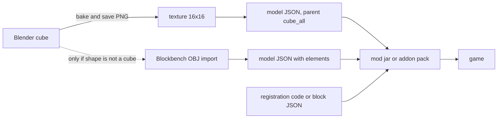

# Creating a Custom Block in Minecraft

How a brand new block type, rather than a variant of an existing one, gets made and shipped.

Java Edition needs a mod, written here against Fabric and Mojang official mappings. Bedrock Edition needs an addon, which is pure JSON. The two share nothing but the texture, so both halves are covered.

Target versions are listed in [README.md](README.md). Java Edition moved to year-based numbering in 2026, so `1.21.x` was followed by `26.1`, `26.2` and `26.3`, while Bedrock stayed on `1.21.x`. Anything written for `1.20` or `1.21` will differ from what is below.

## The core fact

Minecraft does not load Blender meshes. Block rendering uses its own JSON model format, in which geometry is an `elements` array of axis-aligned boxes. There are no triangles and no arbitrary meshes.

A plain cube needs no geometry at all, only a `parent` reference. So the useful output of a Blender cube is the **texture PNG**, not the model.



## 1. Saving the work out of Blender

### Cube case

1. UV unwrap the cube.
2. Bake the material to an image. Use a power-of-two size: 16x16, 32x32 or 64x64. Vanilla blocks are 16x16.
3. `Image > Save As` and choose PNG.
4. Keep it crisp. Minecraft renders block textures with a nearest-neighbour filter, so any blur baked into the source stays visible.
5. Discard the `.blend` mesh. It has no further use.

### Non-cube case

1. In Blender: `File > Export > Wavefront (.obj)`.
2. Open [Blockbench](https://blockbench.net), which is free and purpose-built for Minecraft models. Create a new "Java Block/Item" project and use `File > Import > OBJ`.
3. Rework the shape into box elements. Model bounds must stay within -16 to 32 on every axis.
4. `File > Export > Java Block/Item Model` to get the JSON.

Blender-to-JSON plugins exist but are unreliable across versions. Exporting OBJ and finishing in Blockbench is the dependable path.

## 2. Java Edition file layout

```
src/main/resources/
  fabric.mod.json
  assets/<modid>/
    textures/block/<name>.png
    models/block/<name>.json
    items/<name>.json
    blockstates/<name>.json
    lang/en_us.json
  data/<modid>/
    loot_table/blocks/<name>.json
  data/minecraft/tags/block/mineable/pickaxe.json
src/main/java/<package>/
  <ModClass>.java
```

`models/block/<name>.json` defines how the block looks:

```json
{
  "parent": "minecraft:block/cube_all",
  "textures": { "all": "<modid>:block/<name>" }
}
```

`blockstates/<name>.json` maps block states to models. A block with no state properties has a single empty variant:

```json
{
  "variants": { "": { "model": "<modid>:block/<name>" } }
}
```

`items/<name>.json` is an item model definition, the format introduced in 1.21.4. It is not a plain model and does not live under `models/item/`:

```json
{
  "model": {
    "type": "minecraft:model",
    "model": "<modid>:block/<name>"
  }
}
```

`data/<modid>/loot_table/blocks/<name>.json` makes the block drop itself when broken. Without it the block drops nothing:

```json
{
  "type": "minecraft:block",
  "pools": [
    {
      "rolls": 1,
      "entries": [{ "type": "minecraft:item", "name": "<modid>:<name>" }],
      "conditions": [{ "condition": "minecraft:survives_explosion" }]
    }
  ]
}
```

Both `loot_table` and `tags/block` are singular. They were renamed from the plural forms in 1.21, and older tutorials still show `loot_tables` and `tags/blocks`.

`lang/en_us.json` supplies the display name:

```json
{ "block.<modid>.<name>": "My Block" }
```

## 3. Java Edition registration

26.2 split block ids and item ids apart. A block that has a matching item is identified by a `BlockItemId` carrying both keys, and the properties object is given its id before the block is constructed.

```java
private static Block register(ResourceKey<Block> id, Function<BlockBehaviour.Properties, Block> blockFactory, BlockBehaviour.Properties properties) {
	Block block = blockFactory.apply(properties.setId(id));
	return Registry.register(BuiltInRegistries.BLOCK, id, block);
}

private static Block register(BlockItemId id, Function<BlockBehaviour.Properties, Block> blockFactory, BlockBehaviour.Properties properties) {
	Block block = register(id.block(), blockFactory, properties);
	BlockItem blockItem = new BlockItem(block, new Item.Properties().useBlockDescriptionPrefix().setId(id.item()));
	Registry.register(BuiltInRegistries.ITEM, id.item(), blockItem);
	return block;
}

public static final BlockItemId MY_BLOCK_ID = BlockItemId.create(id("my_block"), id("my_block"));

public static final Block MY_BLOCK = register(
		MY_BLOCK_ID,
		Block::new,
		BlockBehaviour.Properties.of()
				.strength(1.5F, 6.0F)
				.sound(SoundType.STONE)
				.mapColor(MapColor.QUARTZ)
				.lightLevel(state -> 7)
				.requiresCorrectToolForDrops()
);
```

`useBlockDescriptionPrefix()` keeps the translation key at `block.<modid>.<name>`.

Identifiers are built with `Identifier.fromNamespaceAndPath(MOD_ID, path)`.

Adding the block to a creative tab:

```java
CreativeModeTabEvents.modifyOutputEvent(CreativeModeTabs.BUILDING_BLOCKS).register(creativeTab -> {
	creativeTab.accept(MY_BLOCK.asItem());
});
```

## 4. Java Edition properties

"Behaves like sand" is really three independent settings.

| Trait | Where it comes from |
| --- | --- |
| Falls under gravity | The block class passed as the factory |
| Fast to dig with a given tool | The data tag `minecraft:mineable/<tool>` |
| Hardness, sound, map colour, light | `BlockBehaviour.Properties` in code |

`.strength(1.5F, 6.0F)` sets hardness and blast resistance; the single-argument form sets both to the same value. `.requiresCorrectToolForDrops()` means the block drops nothing when broken by hand, so omit it for a hand-breakable block.

Other settings worth knowing: `.noOcclusion()` for glass-like or leaf-like blocks, `.randomTicks()`, `.noLootTable()`, `.lightLevel(state -> 15)`, `.pushReaction(PushReaction.DESTROY)` and `.instrument(NoteBlockInstrument.BASS)`.

The tool tag goes in `data/minecraft/tags/block/mineable/pickaxe.json`:

```json
{ "replace": false, "values": ["<modid>:<name>"] }
```

26.3 removed every block `Codec` and the `block_type` registry, so guidance about block codecs written for earlier versions no longer applies.

## 5. Bedrock Edition

An addon is two packs and no code.

```
<name>_bp/
  manifest.json
  blocks/<name>.json
<name>_rp/
  manifest.json
  blocks.json
  texts/en_US.lang
  textures/terrain_texture.json
  textures/blocks/<name>.png
```

Each manifest needs its own UUIDs, and the behaviour pack declares a dependency on the resource pack's header UUID.

The block itself is a component document:

```json
{
  "format_version": "1.21.0",
  "minecraft:block": {
    "description": {
      "identifier": "<modid>:<name>",
      "menu_category": { "category": "construction" }
    },
    "components": {
      "minecraft:geometry": "minecraft:geometry.full_block",
      "minecraft:material_instances": {
        "*": { "texture": "<name>", "render_method": "opaque" }
      },
      "minecraft:destructible_by_mining": { "seconds_to_destroy": 1.5 },
      "minecraft:destructible_by_explosion": { "explosion_resistance": 6 },
      "minecraft:light_emission": 7
    }
  }
}
```

`texture` is a key, not a path. `terrain_texture.json` binds that key to the PNG.

Block `format_version` 1.21.0 is stable, so no experimental toggle is needed.

## 6. Shipping it

Neither edition needs files copied into game directories by hand.

Bedrock: zip the two pack folders together and rename the zip to `.mcaddon`. Opening that one file imports both packs. For a shared world, apply the packs to a Realm or list them in a dedicated server's `world_behavior_packs.json` and `world_resource_packs.json`, and joining clients download them automatically.

Java: a mod is code, so a server never pushes it to clients. Each player installs it. The least friction is a `.mrpack` modpack holding the mod jar and Fabric API in `overrides/mods/`, opened with the Modrinth App, which installs the loader itself.

There is no marketplace route for either. The Bedrock Marketplace is partner-gated and commercial, and Java Edition has no equivalent at all.

See [custom_blocks/eye_block/README.md](custom_blocks/eye_block/README.md) for a worked example of both.
