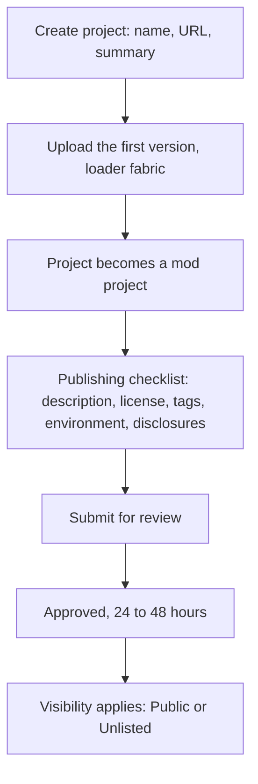

# minecraft-mods

Custom Minecraft blocks, built for both editions from one source of art.

Each mod lives in its own Gradle module. Java Edition players install it from Modrinth, where the mod jar is published as its own project and the Modrinth App pulls in Fabric API on its own. Bedrock Edition players open a `.mcaddon` attached to a GitHub release, which the game imports.

The build also produces a `.mrpack` modpack, which is for handing someone a whole preconfigured instance rather than for publishing.

## Documentation

| Document | Covers |
| --- | --- |
| This file | Repository layout, toolchain, build and release commands, conventions. |
| [CUSTOM-BLOCK-MANUAL.md](CUSTOM-BLOCK-MANUAL.md) | How a custom block is made: Blender, model formats, registration, Bedrock components, and why the two editions never share a build. |
| [custom_blocks/README.md](custom_blocks/README.md) | The Custom Blocks mod: its blocks, its files, its property values, and how to add another block. |

## Mods

| Module | Mod id | Blocks | Editions | Status |
| --- | --- | --- | --- | --- |
| [`custom_blocks`](custom_blocks) | `custom_blocks` | `eye_block` | Java and Bedrock | Java mod verified in game, block and recipe both working; version `1.0.0+26.3` uploaded to Modrinth, checklist complete, review outstanding; Bedrock addon builds, not yet loaded |

## Repository layout

```
run.sh                         one command per release step, check through release
settings.gradle                Gradle multi-project, one include per mod
gradle.properties              every version, in one place
build.gradle                   root project, pins the wrapper version
gradle/mod-conventions.gradle  shared Java and packaging config
gradle/wrapper/                Gradle wrapper, committed
custom_blocks/                 the Custom Blocks mod, one module
custom_blocks/blocks/<name>/   per-block source art and spec
images/                        original artwork
```

## Toolchain

| Component | Version |
| --- | --- |
| Minecraft Java Edition | 26.3 |
| Java | 25 |
| Fabric Loader | 0.19.5 |
| Fabric API | 0.161.0+26.3 |
| Fabric Loom | 1.17-SNAPSHOT |
| Gradle | 9.6.0 |
| Minotaur | 2.10.0 |
| Minecraft Bedrock Edition | 26.50 or later |

Every build prints that deprecated Gradle features make it incompatible with Gradle 10. That comes from Loom, not from anything in this repository: the warning follows Loom across versions and needs a major Loom release to clear. Ignore it.

Every version above lives in `gradle.properties`. Change it there and nowhere else. `gradle/wrapper/gradle-wrapper.properties` carries the Gradle version separately, because the wrapper has to know it before Gradle starts.

### Why these versions look unfamiliar

Mojang moved to year-based version numbers in 2026, so Java Edition's `1.21.x` line was followed by `26.1`, `26.2` and `26.3`. Bedrock Edition moved too, on its own scale: `26.50` is the same drop as Java `26.3`, and both shipped on 2026-09-15.

Bedrock keeps the old `1.x` numbering alongside the new one, so `26.50` is also `1.26.50`. Pack manifests still use the `1.x` form, which is why `min_engine_version` reads `[1, 21, 0]` rather than anything starting with 26.

A tutorial written against `1.20` or `1.21` will differ from this repository in registration code, in resource paths, and in folder names.

### Why Mojang mappings, and why there is no remapJar

Minecraft used to ship obfuscated, so mod code was written against a mapping set and the built jar was remapped on the way out. That ended: Mojang stopped obfuscating, and from 1.21.11 onwards the game ships with its real names. Class names here read `BlockBehaviour.Properties`, `BuiltInRegistries` and `Identifier`. Older tutorials use Yarn, where the same classes are `AbstractBlock.Settings`, `Registries` and `Identifier`. The two are not mixable inside one module.

The plugin id encodes which world a version lives in. `net.fabricmc.fabric-loom`, used here, is the unobfuscated path and skips every remapping step, so **there is no `remapJar` task** and plain `jar` is the shippable artifact. `net.fabricmc.fabric-loom-remap` is the one for 1.21.11 and older. Any build snippet that assigns `remapJar` fails here with `Could not get unknown property 'remapJar'`.

## Setup

Java 25 is required. On Ubuntu:

```
sudo apt install -y openjdk-25-jdk
```

Gradle itself needs no install. The committed wrapper downloads 9.6.0 on first run.

## One command per step

`run.sh` wraps the whole release path, each command running the ones before it, so a full release is a single invocation that stops at the first thing that is wrong:

```
./run.sh check      versions agree, changelog names this version, token present
./run.sh build      the above, then the mod jar
./run.sh pack       the above, then dist/*.mcaddon and dist/*.mrpack
./run.sh dry-run    the above, then the Modrinth payload, uploading nothing
./run.sh publish    the above, then the upload to Modrinth
./run.sh release    the above, then the GitHub release with both packs attached
./run.sh version    the version this would publish, such as 1.0.0+26.3
```

A second argument picks the module, defaulting to `custom_blocks`: `./run.sh publish my_other_mod`.

`check` is what stops the two failure modes that only surface at a player's end: `mod_version` disagreeing with `PACK_VERSION`, and a changelog still describing the previous release. It runs first in every other command, so there is no way to publish around it.

The sections below cover the underlying Gradle and script commands, several of which `run.sh` chains, and which remain the way to run a single step on its own.

## Building

Run a development client with the mod loaded:

```
./gradlew :custom_blocks:runClient
```

Build the mod jar into `custom_blocks/build/libs/`:

```
./gradlew :custom_blocks:build
```

Build the two distributable files into `<mod>/dist/`:

```
cd custom_blocks && ./package.sh
```

`package.sh` always builds the `.mcaddon`, which needs only the Bedrock pack folders. It builds the `.mrpack` when the mod jar and the Fabric API jar are both present, and otherwise skips it with a message naming what is missing.

## Publishing to Modrinth

Each mod becomes a **mod** project, which installs the jar into the profile a friend already plays while the Modrinth App resolves Fabric API from the declared dependency. A **modpack** project would create a separate instance with its own world, which is the opposite of what is wanted here.

Nothing in the creation dialog asks which of the two it is. Modrinth derives the project type from the loaders on the first version: `fabric` makes it a mod, `mrpack` makes it a modpack. So the type is decided by what gets uploaded, not by a setting, and uploading the wrong artifact first is the way to get the wrong kind of project.

### One-time, per mod



1. Create the project at `https://modrinth.com/dashboard/projects`. The dialog asks for **Type**, **URL**, **Owner**, **Visibility** and **Summary** only. Type is `Project`, not `Server`; `Server` is for server listings, not for content. Visibility is what applies **after** approval, not now.
2. Put the chosen URL slug in the module's `build.gradle` as `ext.modrinthProjectId`.
3. Upload the first version, either through Minotaur as below or in the web UI. This is what fixes the project type, and tags and content disclosures stay locked until a version exists.
4. Work through the publishing checklist on the project page: description, license `MIT` to match [LICENSE](LICENSE), source link to this repository, categories, environment, and the content disclosures. The checklist gates the submit button, and every field on it is a content rule. The next section says what each must contain.
5. Submit for review. Modrinth reviews every new project by hand, targeting 24 to 48 hours. Editing while queued does not lose your place.
6. After approval, `Unlisted` keeps the project off search while the direct link still installs; `Public` makes it searchable.

A draft is visible only to project members, so there is no way to share it before review, and no way to automate this part: Minotaur uploads versions, never projects.

The name is the mod name alone. A version number, a loader name or a tagline in it is a rejection reason.

### Content rules

Modrinth's [content rules](https://modrinth.com/legal/rules) are part of its [terms of use](https://modrinth.com/legal/terms), and a human reviewer checks them on every first publish. Most cover cheat clients and illegal material and never touch a block mod. These five do:

| Rule | What it requires here |
| --- | --- |
| Clear and honest function | The description answers what the mod adds, why to download it, and what to know first: Java with Fabric only, Fabric API required, Bedrock shipped on GitHub instead. Plain text, English, and no headers used as body text. |
| Generative AI | The "Contains AI-generated content" disclosure is required when a substantial portion of the code, or any part of the project page, is AI output. Code and documentation written with an agent meet that. An icon or gallery image created or derived from generative AI is prohibited outright, and a project whose contents are primarily AI output may not be published. |
| Metadata | The title is the mod name alone, matching `fabric.mod.json` rather than the URL slug. The summary neither repeats the title nor carries formatting. License, environment and tags agree with this repository. |
| Copyright | Everything shipped is licensed for redistribution and credits its source. One texture goes into both the jar and the Bedrock pack, so its provenance decides both. Third-party mods are declared, never bundled, which is why the `.mrpack` stays on GitHub. |
| Content disclosures | Ten exist. Enable the ones that apply and leave the rest off: a mod that sends nothing sets no telemetry disclosure, and Modrinth's own download tracking is never the creator's to disclose. |

A rights complaint runs through [DMCA](https://modrinth.com/legal/copyright), and repeat infringements cost the account rather than the one project, so asset provenance is settled before a first publish rather than after a notice.

### Every release

Minotaur uploads versions to a project that already exists, draft projects included.

Create a token at `https://modrinth.com/settings/pats` with the `VERSION_CREATE` scope only, then put it in `.env` at the repository root:

```
MODRINTH_TOKEN=mrp_...
```

`.env` is gitignored and is never read by anything but the build. `gradle/mod-conventions.gradle` prefers a `MODRINTH_TOKEN` environment variable when one is set and falls back to that file, so CI can export the variable while a local run needs no `export` at all:

```
./run.sh publish
```

The version number, name, game version, loader and Fabric API dependency are all derived in `gradle/mod-conventions.gradle` from `gradle.properties` and the module's `ext` values, so a release needs no edits there. The version changelog is the module's `CHANGELOG.md`.

A dry run needs no file edit:

```
./run.sh dry-run
```

It prints the full payload and skips the upload. It still authenticates and still looks the project up, because Minotaur builds its API client before it checks the debug flag, so a missing or wrong token fails the same way it would on a real run. A slug that does not resolve is only logged in debug mode rather than failing.

## Releasing on GitHub

The GitHub release carries the Bedrock addon, which has no Modrinth equivalent, and the `.mrpack` for anyone who wants a ready-made instance. `./run.sh release` does the Modrinth upload and this in one go, tagging `v<mod_version>` and attaching whichever of the two packs `dist/` holds. By hand it is:

```
gh release create v1.0.0 \
  custom_blocks/dist/CustomBlocks-1.0.0.mcaddon \
  custom_blocks/dist/CustomBlocks-1.0.0.mrpack \
  --notes "Custom Blocks 1.0.0"
```

Push the branch first, or the tag points at history GitHub does not have.

Bedrock players open the `.mcaddon` and the game imports it. The `.mrpack` opens in the Modrinth App, which installs Fabric Loader and copies the bundled mods into a new instance.

Testing that half from WSL means crossing to the Windows host, since Bedrock Edition has no Linux client. The UWP install keeps its data under `/mnt/c/Users/<user>/AppData/Local/Packages/Microsoft.MinecraftUWP_8wekyb3d8bbwe/LocalState/games/com.mojang/`, and copying the two pack folders into its `development_behavior_packs/` and `development_resource_packs/` loads them fresh on each game start, which is the fast loop. Import the `.mcaddon` itself at least once before releasing, because that is what players actually do.

That `.mrpack` bundles Fabric API inside `overrides/mods/`, which is fine for a file handed over directly but would be rejected as a Modrinth modpack project: Modrinth requires third-party mods to be declared, not bundled. Publishing it there would mean moving Fabric API into the manifest's `files[]` with its hashes and a `cdn.modrinth.com` URL.

Raise `mod_version` in `gradle.properties` and `PACK_VERSION` in the module's `pack.env` for each release, so player instances update cleanly rather than colliding. `./run.sh check` refuses to go further when the two disagree.

A published version number can never be reused. Modrinth rejects a duplicate, and deleting a version to re-upload the same number leaves Modrinth App instances stuck reporting an update they never finish. Correcting a released jar means a new number, not a replacement.

## Conventions

Committed: source, assets, Bedrock packs, build scripts, the Gradle wrapper, and the original artwork under `images/`.

Not committed: build output, IDE files, each module's `dist/` output, the third-party jars in `vendor/mods/`, and `.env`, which holds the Modrinth token. See `.gitignore` for the exact patterns. A release carries the built artifacts, so the repository does not need to.

Fabric API is downloaded into `<mod>/vendor/mods/` by hand and redistributed inside the `.mrpack`. Its Apache-2.0 license permits that.

## Adding another block

A Gradle module is one **mod**, not one block, so a new block goes inside an existing module and touches no build file. [custom_blocks/README.md](custom_blocks/README.md) has the full checklist.

Two jars declaring the same mod id make Fabric Loader refuse to start, and giving the second jar its own id turns the block into a separate mod, with its own Modrinth project, its own review wait and its own install for every player. That is why blocks share a module.

## Adding another mod

Only for something genuinely separate from `custom_blocks`, not for a new block.

1. Create `<name>/` at the repository root with `build.gradle`, `src/main/java` and `src/main/resources`.
2. Copy `build.gradle` from `custom_blocks` and change `archivesName`, `ext.modrinthProjectId` and `ext.modrinthTitle`.
3. Add `include '<name>'` to `settings.gradle`.
4. Add a `CHANGELOG.md`, which becomes the Modrinth version changelog.
5. Copy `build.sh`, `package.sh` and `pack.env`, and create the mod's own Bedrock pack pair with four fresh UUIDs.
6. Add a row to the Mods table above, and create a separate Modrinth project.

Shared build settings belong in `gradle/mod-conventions.gradle`, not in each module.

## License

MIT. See [LICENSE](LICENSE).
