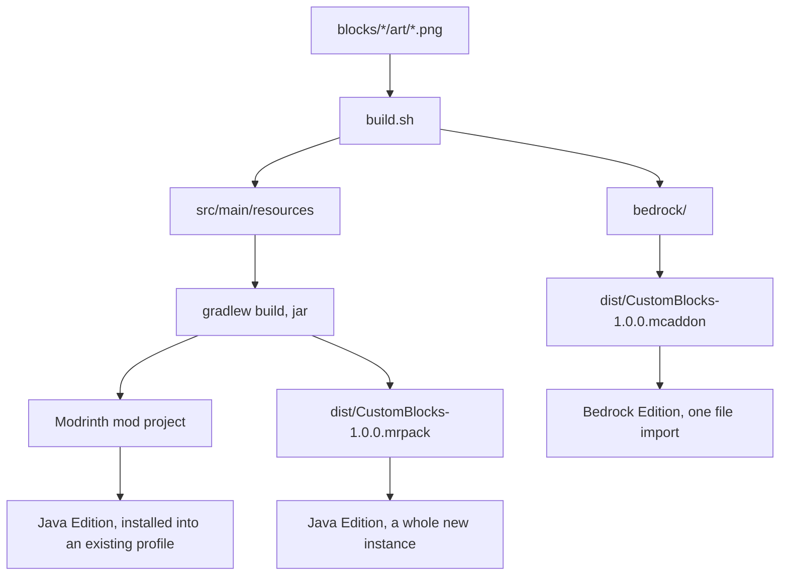

# Custom Blocks

One mod, mod id `custom_blocks`, holding every block in this collection. It ships twice, because Java Edition and Bedrock Edition share nothing but the texture PNG.

[CUSTOM-BLOCK-MANUAL.md](../CUSTOM-BLOCK-MANUAL.md) explains how custom blocks work in general. [README.md](../README.md) has the toolchain, build commands and release process.

## Blocks

| Block | Identifier | What it is |
| --- | --- | --- |
| Eye Block | `custom_blocks:eye_block` | A full cube showing `blocks/eye_block/art/eye_block.png` on all six faces, emitting light level 7, mined with a stone pickaxe or better. |

## Status

The Java mod is verified end to end on Minecraft 26.3 with Fabric Loader 0.19.5: it compiles, the Eye Block registers, places and renders its texture on all six faces with a working item icon, and the crafting recipe produces the block. That was re-checked after blocks moved into `ModBlocks.java`, which confirms registration still runs at mod init.

The Bedrock addon builds into a valid `.mcaddon` but has not yet been loaded by the game, so its recipe is untested.

The Modrinth project is `custom-blocks-pilniczek`, which `ext.modrinthProjectId` in `build.gradle` points at. Version `1.0.0+26.3` is uploaded, carrying the `fabric` loader, which is what settles the project type as a mod rather than a modpack. The publishing checklist is complete and review is outstanding, so the project is still visible only to its members and the public API returns 404 for it.

### Content rules

Checked against [Modrinth's content rules](https://modrinth.com/legal/rules), which [README.md](../README.md) summarises.

| Rule | State |
| --- | --- |
| Prohibited content, cheats | Clean. The mod sends nothing anywhere and changes no multiplayer behaviour. |
| Clear and honest function | The description names what the mod adds, why to take it, and that it is Java with Fabric only, needs Fabric API, and ships its Bedrock half on GitHub. |
| Metadata | Project name `Custom Blocks`, matching `fabric.mod.json` rather than the URL slug. The summary repeats neither the title nor any formatting. License `MIT` agrees with [LICENSE](../LICENSE). |
| Copyright | `blocks/eye_block/art/eye_block.png` is hand-painted by the project owner, so it needs no upstream credit and is free to serve as the project icon. Fabric API is declared as a dependency, never bundled into the jar. |
| Generative AI | The "Contains AI-generated content" disclosure is enabled, for code and for page text. It does not extend to the artwork. |

The remaining gate is the manual review every new Modrinth project waits through. Visibility is Public, which applies once review passes. The version is not featured, since featuring only disambiguates between several coexisting versions.

## Layout

```
build.gradle              module definition, Modrinth project id
CHANGELOG.md              the Modrinth version changelog
pack.env                  pack name, pack version, target versions
build.sh                  copies every block texture into src and bedrock
package.sh                builds the shippable .mcaddon and .mrpack
blocks/<name>/art/        the one real source asset per block
blocks/<name>/spec.json   the intended properties, edition-neutral
src/main/java/            the Fabric mod
src/main/resources/       assets and data for every block
bedrock/                  the two Bedrock packs, one pair for every block
vendor/mods/              Fabric API jar, downloaded by hand, not committed
dist/                     build output, not committed
```

`spec.json` is not read by Minecraft. It records what a block is meant to be, so the Java and Bedrock outputs can be checked against one description instead of against each other.

Each texture lives in exactly one place, under `blocks/<name>/art/`. `build.sh` copies all of them into both builds, and `package.sh` runs `build.sh` first, so a texture change needs no manual copying.

## Adding a block

Nothing here creates a Gradle module. Every step adds files to this one.

1. `blocks/<name>/art/<name>.png`, 16x16 or another power of two.
2. `blocks/<name>/spec.json`, copied from `eye_block` and edited.
3. The Java resource files listed below, one set per block.
4. One `register(...)` constant in `ModBlocks.java`.
5. Append the identifier to `data/minecraft/tags/block/mineable/<tool>.json`, and to `needs_<tier>_tool.json` if the block requires a tool tier.
6. A Bedrock block file, a recipe file, a `terrain_texture.json` entry, a `blocks.json` entry and a `.lang` line, all inside the existing pack pair.
7. `./build.sh`, then a row in the Blocks table above and a `CHANGELOG.md` entry.

## Crafting the Eye Block

One rotten flesh, four dirt around it, on a crafting table. Corners stay empty, so the shape is a plus:

```
[    ][dirt ][    ]
[dirt][flesh][dirt]
[    ][dirt ][    ]
```

Shaped, so the plus shape is required, but it may sit anywhere in the 3x3 grid. It yields one Eye Block.

`spec.json` holds the recipe once, under `recipe`, and each edition restates it in its own format. Both use the same `pattern` strings and the same key letters, which makes the two files easy to compare.

## Flow



## Java Edition files

Per block, under `src/main/resources/`, with `<name>` being the block:

| File | Role |
| --- | --- |
| `assets/custom_blocks/textures/block/<name>.png` | The texture. Written by `build.sh`, not by hand. |
| `assets/custom_blocks/models/block/<name>.json` | Inherits `cube_all`, one texture on six faces. |
| `assets/custom_blocks/items/<name>.json` | Item model definition. Not a plain model, and not under `models/item/`. |
| `assets/custom_blocks/blockstates/<name>.json` | Maps the single state to the block model. |
| `data/custom_blocks/loot_table/blocks/<name>.json` | Drops itself when broken. |
| `data/custom_blocks/recipe/<name>.json` | The shaped crafting recipe. |
| `data/custom_blocks/advancement/recipes/building_blocks/<name>.json` | Unlocks the recipe in the recipe book. |

Shared by every block:

| File | Role |
| --- | --- |
| `assets/custom_blocks/lang/en_us.json` | One display name per block. |
| `data/minecraft/tags/block/mineable/pickaxe.json` | Which blocks a pickaxe digs quickly. |
| `data/minecraft/tags/block/needs_stone_tool.json` | Which blocks require a tool tier. |
| `fabric.mod.json` | Mod metadata and entrypoint. `${version}` is filled at build time from `mod_version`. |
| `java/com/example/customblocks/ModBlocks.java` | One `register(...)` constant per block, plus the creative-tab lists. |
| `java/com/example/customblocks/CustomBlocks.java` | The entrypoint: mod id, identifier helper, creative tab wiring. |

The local `buildingBlocks` variable in `onInitialize` is load-bearing and must not be inlined into the lambda. Reading that field outside the lambda is what triggers `ModBlocks`'s static initializer during mod init, which is when every `register(...)` call runs. Inline it and registration is deferred until a creative tab is first built.

### Tuning

All behaviour is the `BlockBehaviour.Properties` chain in `ModBlocks.java`.

| Call | Effect |
| --- | --- |
| `.strength(1.5F, 6.0F)` | Hardness then blast resistance. Sand is `0.5F`. |
| `.lightLevel(state -> 7)` | Light level, 0 to 15. |
| `.requiresCorrectToolForDrops()` | Drops nothing when broken by hand. Remove it with the `needs_stone_tool` tag for a hand-breakable block. |
| `.sound(SoundType.STONE)` | Step, break and place sounds. |
| `.mapColor(MapColor.QUARTZ)` | Colour shown on maps. |

For sand behaviour, pass a falling block factory instead of `Block::new` and move the tag to `mineable/shovel`.

## Bedrock Edition files

One pack pair serves every block. A second pack pair would mean four more UUIDs, a second `.mcaddon` and a second import for the player.

Per block:

| File under `bedrock/` | Role |
| --- | --- |
| `custom_blocks_bp/blocks/<name>.json` | The block itself: geometry, material, hardness, light, map colour. |
| `custom_blocks_bp/recipes/<name>.json` | The shaped crafting recipe, including its own recipe-book unlock. |
| `custom_blocks_rp/textures/blocks/<name>.png` | The texture. Written by `build.sh`. |

Shared:

| File under `bedrock/` | Role |
| --- | --- |
| `custom_blocks_bp/manifest.json` | Behaviour pack identity; depends on the resource pack UUID. |
| `custom_blocks_rp/manifest.json` | Resource pack identity. |
| `custom_blocks_rp/textures/terrain_texture.json` | One entry per block, binding a texture key to a PNG path. |
| `custom_blocks_rp/blocks.json` | One entry per block, assigning its sound set. |
| `custom_blocks_rp/texts/en_US.lang` | One display name per block. |

The manifests declare `min_engine_version` `[1, 21, 0]`, the floor in Bedrock's older numbering. Current Bedrock is `26.50`, equally `1.26.50`, so it clears that floor. The four UUIDs are fixed: changing one makes an already-installed pack look like a different pack.

Block and recipe `format_version` 1.21.0 is stable, so no experimental toggle is needed. That number is a schema version, unrelated to the game version.

### Tuning

Everything is in `bedrock/custom_blocks_bp/blocks/<name>.json` under `components`.

| Component | Effect |
| --- | --- |
| `minecraft:destructible_by_mining` | Base `seconds_to_destroy` plus the per-tool speeds. |
| `minecraft:destructible_by_explosion` | Blast resistance. |
| `minecraft:light_emission` | Light level, 0 to 15. |
| `minecraft:material_instances` | Texture key and render method. `alpha_test` for a cut-out texture, `blend` for translucency. |
| `minecraft:geometry` | `minecraft:geometry.full_block` for a cube. A custom shape needs a geometry file exported from Blockbench into `custom_blocks_rp/models/blocks/`. |

Bedrock has no equivalent of the Java `needs_stone_tool` tag. Tool tier gating is approximated by the per-tool destroy speeds, and a hard requirement needs a `minecraft:loot` component pointing at a loot table with tool conditions.

## Property mapping

The same intent, expressed twice:

| Intent | Java | Bedrock |
| --- | --- | --- |
| Hardness | `.strength(1.5F, 6.0F)` | `minecraft:destructible_by_mining.seconds_to_destroy` |
| Blast resistance | second argument of `.strength` | `minecraft:destructible_by_explosion.explosion_resistance` |
| Light | `.lightLevel(state -> 7)` | `minecraft:light_emission: 7` |
| Texture binding | the block model `textures` map | `terrain_texture.json` plus `material_instances` |
| Shape | `elements` in the model JSON | a geometry file plus `minecraft:geometry` |
| Sound | `.sound(SoundType.STONE)` | `blocks.json` sound entry |
| Name | `lang/en_us.json` | `texts/en_US.lang` |
| Creative tab | a list constant in `ModBlocks` | `description.menu_category` |
| Recipe | `data/custom_blocks/recipe/<name>.json` | `custom_blocks_bp/recipes/<name>.json` |
| Recipe book unlock | a separate advancement under `advancement/recipes/` | the `unlock` array inside the recipe |

## Packaging

`../run.sh pack` from anywhere in the repository does the jar and both deliverables, having first checked that the versions agree. `./package.sh` here does the packs alone:

```
dist/CustomBlocks-1.0.0.mcaddon     both Bedrock packs, zipped
dist/CustomBlocks-1.0.0.mrpack      modrinth.index.json plus overrides/mods/
```

The `.mcaddon` builds unconditionally. The `.mrpack` needs three things, and names whichever is missing:

1. `FABRIC_LOADER_VERSION` set in `pack.env`.
2. The mod jar in `build/libs/`, from `./gradlew :custom_blocks:build`.
3. The Fabric API jar in `vendor/mods/`.

Source jars and dev jars are skipped. Archiving uses Python, so no `zip` binary is needed.

`pack.env` holds `PACK_VERSION`, which names the output files and fills `versionId` in the manifest. The Minecraft and loader versions there must match `gradle.properties`, and `run.sh check` compares all three pairs.

`CHANGELOG.md` needs a heading for the version being released, because it becomes that version's public changelog on Modrinth and cannot be swapped later without editing the version by hand. `run.sh check` refuses a release whose changelog still describes the previous one.

Neither file is what Java players install. The jar itself is published to Modrinth as a mod project, and the `.mrpack` exists for handing someone a complete instance. [README.md](../README.md) has the publishing steps.

`ext.modrinthTitle` is `Custom Blocks` and names the version, not the project, so versions read "Custom Blocks 1.0.0 for Minecraft 26.3".
