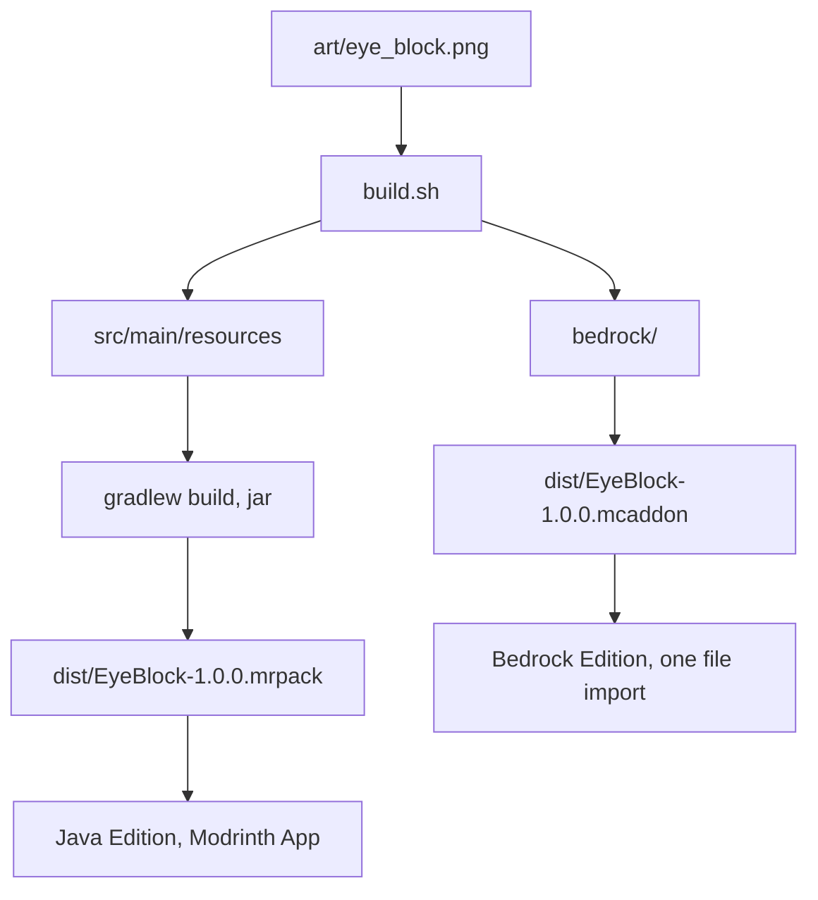

# Eye Block

A full cube showing `art/eye_block.png`, copied from the repository's `images/eye.png`, on all six faces, emitting light level 7, mined with a pickaxe.

Identifier in both editions: `custom_blocks:eye_block`.

Two independent builds come out of this module, because Java Edition and Bedrock Edition share nothing but the texture. [CUSTOM-BLOCK-MANUAL.md](../../CUSTOM-BLOCK-MANUAL.md) explains why, and how custom blocks work in general. [README.md](../../README.md) has the toolchain, build commands and release process.

## Status

The Java mod is verified: it compiles, loads under Fabric Loader 0.19.5 on Minecraft 26.3, and the block registers, places and renders its texture on all six faces with a working item icon.

The Bedrock addon builds into a valid `.mcaddon` but has not yet been loaded by the game.

## Flow



## Layout

```
art/eye_block.png      the one real source asset
spec.json              the intended properties, edition-neutral
build.sh               copies the texture into src and bedrock
package.sh             builds the shippable .mcaddon and .mrpack
pack.env               pack name, pack version, target versions
build.gradle           Gradle module definition
src/main/              the Fabric mod: Java plus assets and data
bedrock/               the two Bedrock packs
vendor/mods/           Fabric API jar, downloaded by hand, not committed
dist/                  build output, not committed
```

`spec.json` is not read by Minecraft. It records what the block is meant to be, so the Java and Bedrock outputs can be checked against one description instead of against each other.

The texture lives in exactly one place. `build.sh` copies it into both builds, and `package.sh` runs `build.sh` first, so a texture change needs no manual copying.

## Java Edition files

| File under `src/main/` | Role |
| --- | --- |
| `resources/assets/custom_blocks/textures/block/eye_block.png` | The texture. |
| `resources/assets/custom_blocks/models/block/eye_block.json` | Inherits `cube_all`, one texture on six faces. |
| `resources/assets/custom_blocks/items/eye_block.json` | Item model definition. Not a plain model, and not under `models/item/`. |
| `resources/assets/custom_blocks/blockstates/eye_block.json` | Maps the single state to the block model. |
| `resources/assets/custom_blocks/lang/en_us.json` | Display name. |
| `resources/data/custom_blocks/loot_table/blocks/eye_block.json` | Drops itself when broken. |
| `resources/data/minecraft/tags/block/mineable/pickaxe.json` | Pickaxe-mineable. |
| `resources/data/minecraft/tags/block/needs_stone_tool.json` | Minimum tool tier. |
| `resources/fabric.mod.json` | Mod metadata and entrypoint. `${version}` is filled at build time from `mod_version`. |
| `java/com/example/customblocks/CustomBlocks.java` | Registers the block and its item, and adds it to the Building Blocks creative tab. |

### Tuning

All behaviour is the `BlockBehaviour.Properties` chain in `CustomBlocks.java`.

| Call | Effect |
| --- | --- |
| `.strength(1.5F, 6.0F)` | Hardness then blast resistance. Sand is `0.5F`. |
| `.lightLevel(state -> 7)` | Light level, 0 to 15. |
| `.requiresCorrectToolForDrops()` | Drops nothing when broken by hand. Remove it with the `needs_stone_tool` tag for a hand-breakable block. |
| `.sound(SoundType.STONE)` | Step, break and place sounds. |
| `.mapColor(MapColor.QUARTZ)` | Colour shown on maps. |

For sand behaviour, pass a falling block factory instead of `Block::new` and move the tag to `mineable/shovel`.

## Bedrock Edition files

| File under `bedrock/` | Role |
| --- | --- |
| `eye_block_bp/manifest.json` | Behaviour pack identity; depends on the resource pack UUID. |
| `eye_block_bp/blocks/eye_block.json` | The block itself: geometry, material, hardness, light, map colour. |
| `eye_block_rp/manifest.json` | Resource pack identity. |
| `eye_block_rp/textures/terrain_texture.json` | Binds the texture key `eye_block` to the PNG path. |
| `eye_block_rp/textures/blocks/eye_block.png` | The texture. |
| `eye_block_rp/blocks.json` | Assigns the stone sound set. |
| `eye_block_rp/texts/en_US.lang` | Display name. |

Requires Bedrock 1.21 or later. Block `format_version` 1.21.0 is stable, so no experimental toggle is needed.

### Tuning

Everything is in `bedrock/eye_block_bp/blocks/eye_block.json` under `components`.

| Component | Effect |
| --- | --- |
| `minecraft:destructible_by_mining` | Base `seconds_to_destroy` plus the per-tool speeds. |
| `minecraft:destructible_by_explosion` | Blast resistance. |
| `minecraft:light_emission` | Light level, 0 to 15. |
| `minecraft:material_instances` | Texture key and render method. `alpha_test` for a cut-out texture, `blend` for translucency. |
| `minecraft:geometry` | `minecraft:geometry.full_block` for a cube. A custom shape needs a geometry file exported from Blockbench into `eye_block_rp/models/blocks/`. |

Bedrock has no equivalent of the Java `needs_stone_tool` tag. Tool tier gating is approximated by the per-tool destroy speeds, and a hard requirement needs a `minecraft:loot` component pointing at a loot table with tool conditions.

## Property mapping

The same intent, expressed twice:

| Intent | Java | Bedrock |
| --- | --- | --- |
| Hardness | `.strength(1.5F, 6.0F)` | `minecraft:destructible_by_mining.seconds_to_destroy` |
| Blast resistance | second argument of `.strength` | `minecraft:destructible_by_explosion.explosion_resistance` |
| Light | `.lightLevel(state -> 7)` | `minecraft:light_emission: 7` |
| Texture binding | the block model `textures` map | `terrain_texture.json` plus `material_instances` |
| Shape | `elements` in the model JSON | a geometry file plus `minecraft:geometry` |
| Sound | `.sound(SoundType.STONE)` | `blocks.json` sound entry |
| Name | `lang/en_us.json` | `texts/en_US.lang` |
| Creative tab | `CreativeModeTabEvents` in code | `description.menu_category` |

## Packaging

`./package.sh` writes both deliverables into `dist/`:

```
dist/EyeBlock-1.0.0.mcaddon     both Bedrock packs, zipped
dist/EyeBlock-1.0.0.mrpack      modrinth.index.json plus overrides/mods/
```

The `.mcaddon` builds unconditionally. The `.mrpack` needs three things, and names whichever is missing:

1. `FABRIC_LOADER_VERSION` set in `pack.env`.
2. The mod jar in `build/libs/`, from `./gradlew :custom_blocks:eye_block:build`.
3. The Fabric API jar in `vendor/mods/`.

Source jars and dev jars are skipped. Archiving uses Python, so no `zip` binary is needed.

`pack.env` holds `PACK_VERSION`, which names the output files and fills `versionId` in the manifest. The Minecraft and loader versions there must match `gradle.properties`.
