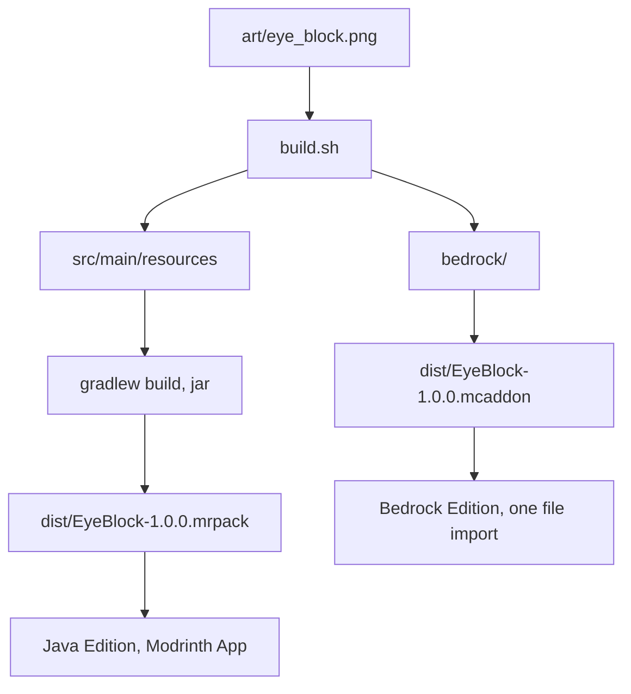

# Eye Block

A full cube showing `images/eye.png` on all six faces, emitting light level 7, mined with a pickaxe.

Identifier in both editions: `custom_blocks:eye_block`.

## Can one block serve both editions?

No. Java Edition and Bedrock Edition share nothing but the texture PNG.

Java Edition loads a mod: compiled Java against the Fabric API, shipped as a jar in `mods/`. The block is a registered object created in code.

Bedrock Edition loads an addon: a behaviour pack plus a resource pack, both pure JSON, with no compiled code. The block is a JSON document of components.

The two use different model formats, different property names, different install locations and different loaders. So this module keeps one shared source and two independent outputs.



## Layout

```
art/eye_block.png      the one real source asset
spec.json              the intended properties, edition-neutral
build.sh               copies the texture into src and bedrock
package.sh             builds the shippable .mcaddon and .mrpack
pack.env               pack name, version and target versions
build.gradle           Gradle module definition
src/main/              the Fabric mod: Java plus assets and data
bedrock/               the two Bedrock packs
vendor/mods/           Fabric API jar, downloaded by hand
dist/                  build output, not committed
```

`spec.json` is not read by Minecraft. It records what the block is meant to be, so the Java and Bedrock outputs can be checked against one description instead of against each other.

Run `./build.sh` after changing the texture. It is a copy step, nothing more. `./package.sh` runs it for you.

## Java Edition

Targets Minecraft 26.3 on Java 25, with Fabric Loader 0.19.5 and Fabric API 0.161.0+26.3. Versions live in the repository root `gradle.properties`.

The code uses Mojang official mappings, which is what Loom and the Fabric documentation now default to. Class names therefore read `BlockBehaviour.Properties`, `BuiltInRegistries` and `Identifier` rather than the older Yarn names.

| File | Role |
| --- | --- |
| `src/main/resources/assets/custom_blocks/textures/block/eye_block.png` | The texture. |
| `src/main/resources/assets/custom_blocks/models/block/eye_block.json` | Inherits `cube_all`, one texture on six faces. |
| `src/main/resources/assets/custom_blocks/items/eye_block.json` | Item model definition, the format used since 1.21.4. Not a plain model, and not under `models/item/`. |
| `src/main/resources/assets/custom_blocks/blockstates/eye_block.json` | Maps the single state to the block model. |
| `src/main/resources/assets/custom_blocks/lang/en_us.json` | Display name. |
| `src/main/resources/data/custom_blocks/loot_table/blocks/eye_block.json` | Drops itself when broken. |
| `src/main/resources/data/minecraft/tags/block/mineable/pickaxe.json` | Pickaxe-mineable. |
| `src/main/resources/data/minecraft/tags/block/needs_stone_tool.json` | Minimum tool tier. |
| `src/main/resources/fabric.mod.json` | Mod metadata and entrypoint. `${version}` is filled in at build time from `mod_version`. |
| `src/main/java/com/example/customblocks/CustomBlocks.java` | Registers the block and its item, and adds it to the Building Blocks creative tab. |

Both directory names above are singular on purpose. Data pack folders were renamed in 1.21: `loot_tables` became `loot_table` and `tags/blocks` became `tags/block`. Some tutorials still show the old plural names.

### Building

From the repository root:

```
./gradlew :custom_blocks:eye_block:runClient
./gradlew :custom_blocks:eye_block:build
```

`runClient` launches a development client with the mod loaded. `build` produces the jar in `custom_blocks/eye_block/build/libs/`.

In game the block appears in the Building Blocks creative tab, or use `/give @s custom_blocks:eye_block`.

### How registration works

26.2 split block ids and item ids apart. A block that has an item is identified by a `BlockItemId` holding both keys, and the properties object carries its own id before the block is constructed:

```java
Block block = blockFactory.apply(properties.setId(id));
Registry.register(BuiltInRegistries.BLOCK, id, block);
```

The `BlockItem` is then registered separately against `id.item()`, with `useBlockDescriptionPrefix()` so the translation key stays `block.custom_blocks.eye_block`.

### Tuning

All behaviour is the `BlockBehaviour.Properties` chain in `CustomBlocks.java`.

- `.strength(1.5F, 6.0F)` is hardness then blast resistance. Sand is `0.5F`.
- `.lightLevel(state -> 7)` is light level, 0 to 15.
- `.requiresCorrectToolForDrops()` means the block drops nothing when broken by hand. Remove it together with the `needs_stone_tool` tag for a hand-breakable block.
- `.sound(SoundType.STONE)` picks step, break and place sounds.
- `.mapColor(MapColor.QUARTZ)` is the colour shown on maps.

For sand behaviour, pass a falling block factory instead of `Block::new` and move the tag to `mineable/shovel`. Note that 26.3 removed every block `Codec` and the `block_type` registry, so guidance written for 1.20 or 1.21 about falling block codecs no longer applies.

## Bedrock Edition

Two packs, no compilation, no build step beyond the zip.

| File | Role |
| --- | --- |
| `bedrock/eye_block_bp/manifest.json` | Behaviour pack identity; depends on the resource pack UUID. |
| `bedrock/eye_block_bp/blocks/eye_block.json` | The block itself: geometry, material, hardness, light, map colour. |
| `bedrock/eye_block_rp/manifest.json` | Resource pack identity. |
| `bedrock/eye_block_rp/textures/terrain_texture.json` | Binds the texture key `eye_block` to the PNG path. |
| `bedrock/eye_block_rp/textures/blocks/eye_block.png` | The texture. |
| `bedrock/eye_block_rp/blocks.json` | Assigns the stone sound set. |
| `bedrock/eye_block_rp/texts/en_US.lang` | Display name. |

Requires Bedrock 1.21 or later. Block `format_version` 1.21.0 is stable, so no experimental toggle is needed.

Bedrock still uses its own `1.21.x` numbering. The year-based scheme applies to Java Edition.

### Tuning

Everything is in `bedrock/eye_block_bp/blocks/eye_block.json` under `components`.

- `minecraft:destructible_by_mining` sets the base `seconds_to_destroy` and the per-tool speeds.
- `minecraft:destructible_by_explosion` sets blast resistance.
- `minecraft:light_emission` is 0 to 15.
- `minecraft:material_instances` picks the texture key and the render method. Use `alpha_test` for a cut-out texture and `blend` for translucency.
- `minecraft:geometry` is `minecraft:geometry.full_block` for a cube; a custom shape needs a geometry file exported from Blockbench into `bedrock/eye_block_rp/models/blocks/`.

Bedrock has no direct equivalent of the Java `needs_stone_tool` tag. Tool tier gating is approximated by the per-tool destroy speeds, and a hard requirement needs a `minecraft:loot` component pointing at a loot table with tool conditions.

### Property mapping

| Intent | Java | Bedrock |
| --- | --- | --- |
| Hardness | `.strength(1.5F, 6.0F)` | `minecraft:destructible_by_mining.seconds_to_destroy` |
| Blast resistance | second argument of `.strength` | `minecraft:destructible_by_explosion.explosion_resistance` |
| Light | `.lightLevel(state -> 7)` | `minecraft:light_emission: 7` |
| Texture binding | the block model `textures` map | `terrain_texture.json` plus `material_instances` |
| Shape | `elements` in the model JSON | a geometry file plus `minecraft:geometry` |
| Sound | `.sound(SoundType.STONE)` | `blocks.json` sound entry |
| Name | `lang/en_us.json` | `texts/en_US.lang` |
| Creative tab | `CreativeModeTabEvents` in code | `description.menu_category` |

## Distribution

Friends install through the Modrinth App, so the Java deliverable is a `.mrpack` modpack published on GitHub Releases.

A `.mrpack` is a zip holding a manifest and an `overrides/` tree:

```
EyeBlock-1.0.0.mrpack
  modrinth.index.json
  overrides/
    mods/
      eye-block-1.0.0.jar
      fabric-api-0.161.0+26.3.jar
```

The manifest names the Minecraft and Fabric Loader versions. The Modrinth App installs the loader itself, then copies `overrides/` into the new instance. The friend opens the file and gets a working instance.

The manifest also supports a `files[]` array of remote downloads, but Modrinth only accepts URLs on `cdn.modrinth.com`, `github.com`, `raw.githubusercontent.com` and `gitlab.com`, and each entry needs SHA-1 and SHA-512 hashes. Shipping the jars inside `overrides/` avoids all of that, so `files[]` stays empty. Fabric API is Apache-2.0, so redistributing it this way is fine.

### Building the packs

1. Build the mod, so a jar exists in `build/libs/`.
2. Run `./package.sh`.

`package.sh` syncs the texture, then builds `dist/EyeBlock-1.0.0.mcaddon` for Bedrock and `dist/EyeBlock-1.0.0.mrpack` for Java. The Bedrock file needs nothing but the pack folders, so it builds every time. The Java file is skipped with a message naming the missing piece when the loader version, the mod jar or the Fabric API jar is absent.

Source jars and dev jars are skipped automatically. Archiving uses Python, so no `zip` binary is needed.

### Releasing

```
gh release create v1.0.0 \
  custom_blocks/eye_block/dist/EyeBlock-1.0.0.mrpack \
  custom_blocks/eye_block/dist/EyeBlock-1.0.0.mcaddon \
  --notes "Eye Block 1.0.0"
```

Send friends the release page. Java players open the `.mrpack` with the Modrinth App. Bedrock players open the `.mcaddon`, which the game imports on its own.

Raise `PACK_VERSION` in `pack.env` and `mod_version` in the root `gradle.properties` for each release, so instances update cleanly rather than colliding.
